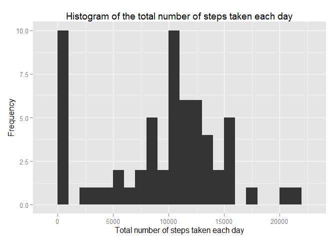
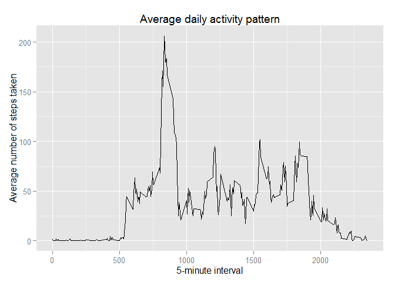
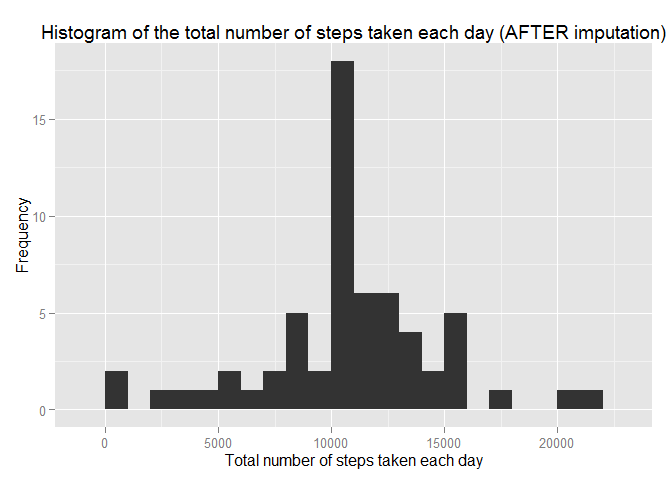
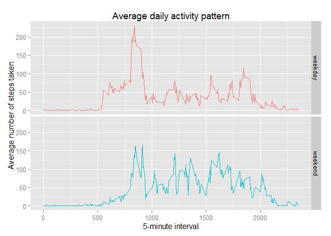

# Reproducible Research: Peer Assessment 1


## Loading and preprocessing the data
Load the data.


```r
unzip(zipfile = "activity.zip")
data <- read.csv("activity.csv")
```

## What is mean total number of steps taken per day?
Calculate the total number of steps taken per day and make a histogram of the total number of steps taken each day.


```r
library(ggplot2)
```

```
## Warning: package 'ggplot2' was built under R version 3.1.3
```

```r
## Calculate the total number of steps taken per day
totalSteps <- tapply(data$steps, data$date, FUN = sum, na.rm = TRUE)

## Make a histogram of the total number of steps taken each day
qplot(totalSteps,
      xlab = "Total number of steps taken each day",
      ylab = "Frequency",
      main = "Histogram of the total number of steps taken each day",
      binwidth = 1000)
```

 

Calculate and report the mean and median of the total number of steps taken per day.

```r
mean(totalSteps)
```

```
## [1] 9354.23
```

```r
median(totalSteps)
```

```
## [1] 10395
```

## What is the average daily activity pattern?
Make a time series plot of the 5-minute interval (x-axis) and the average number of steps taken, averaged across all days (y-axis).


```r
library(ggplot2)

## Calculate the average number of steps taken averaged across all days
averagePattern <- aggregate(x = list(steps = data$steps), by = list(interval = data$interval), FUN = mean, na.rm = TRUE)

## Make a time series plot
ggplot(averagePattern, aes(x = interval, y = steps)) + 
  geom_line() +
  labs(x = "5-minute interval", y = "Average number of steps taken", title = "Average daily activity pattern")
```

 

Report the 5-minute interval that contains the maximum number of steps.

```r
averagePattern[which.max(averagePattern$steps),]
```

```
##     interval    steps
## 104      835 206.1698
```

## Imputing missing values
There are a number of days/intervals where there are missing values (`NA`). The presence of missing days may introduce bias into some calculations or summaries of the data. Calculate and report the total number of missing values in the dataset.


```r
missingValues <- is.na(data$steps)
table(missingValues)
```

```
## missingValues
## FALSE  TRUE 
## 15264  2304
```

**Imputation Strategy:** Make use of the mean value for that 5-minute interval to fill in the missing `steps` values.

Create a new dataset that is equal to the original dataset but with the missing data filled in.


```r
## Create a replaceNA function based on the mean value for that 5-minute interval
replaceNA <- function(steps, interval) {
  toBeReplaced <- NA
  
  if(!is.na(steps)) {
    toBeReplaced <- c(steps)
  } else {
    toBeReplaced <- (averagePattern[averagePattern$interval == interval, "steps"])
  }
  
  return(toBeReplaced)
}

## Copy the contents of the original dataset over to a new dataset
dataImputed <- data

## Call the replaceNA function and apply it to the missing steps values of the new dataset
dataImputed$steps <- mapply(replaceNA, dataImputed$steps, dataImputed$interval)
```

Verify that there are no more missing `steps` values.


```r
## Calculate the number of missing values after imputation
missingValuesImp <- is.na(dataImputed$steps)
table(missingValuesImp)
```

```
## missingValuesImp
## FALSE 
## 17568
```

Make a histogram of the total number of steps taken each day.


```r
library(ggplot2)

## Calculate the total number of steps taken per day
totalStepsImp <- tapply(dataImputed$steps, dataImputed$date, FUN = sum)

## Make a histogram of the total number of steps taken each day
qplot(totalStepsImp,
      xlab = "Total number of steps taken each day",
      ylab = "Frequency",
      main = "Histogram of the total number of steps taken each day (AFTER imputation)",
      binwidth = 1000)
```

 

Calculate and report the mean and median total number of steps taken per day after imputation.


```r
mean(totalStepsImp)
```

```
## [1] 10766.19
```

```r
median(totalStepsImp)
```

```
## [1] 10766.19
```

The values **differ** from the estimates from the first part of this assignment. Both the mean and median have **increased** after imputing the missing data.

The reason behind this increase is because in the initial analysis, observations consisting of NA `steps` values were automatically replaced with 0s, as seen from the first figure which illustrates a large frequency of 0s. However, now that these observations have been imputed with realistic data (based on the mean value for that 5-minute interval), the number of 0s has decreased significantly as shown from the above figure, thus resulting in the increase of the mean and median.

## Are there differences in activity patterns between weekdays and weekends?

Create a function to determine the corresponding day of week for each `date` value in the imputed data and assign it with either a weekday or weekend label.


```r
## Create weekdayWeekend function which determines whether a particular date is a weekday day or a weekend day
weekdayWeekend <- function (date) {
  day <- weekdays(date)
  
  if(day %in% c("Monday", "Tuesday", "Wednesday", "Thursday", "Friday")) {
    return("weekday")
  } else if (day %in% c("Saturday", "Sunday")) {
    return("weekend")
  } else {
    stop("invalid")
  }
}

## Convert each date value in the imputed dataset to an object of "Date" class
dataImputed$date <- as.Date(dataImputed$date)

## Iterate through each object of "Date" class and make use of the weekdayWeekend function to determine if it is either a weekday day or a weekend day
dataImputed$day <- sapply(dataImputed$date, FUN = weekdayWeekend)
```

Make a panel plot containing a time series plot of the 5-minute interval (x-axis) and the average number of steps taken, averaged across all weekday days or weekend days (y-axis).


```r
library(ggplot2)

## Calculate the average number of steps taken averaged across all weekday days or weekend days
averagePatternImputed <- aggregate(steps ~ interval + day, data = dataImputed, mean)

## Make a time series plot
ggplot(averagePatternImputed, aes(x = interval, y = steps, color = day)) + 
  geom_line() +
  facet_grid(day ~ .) +
  theme(legend.position = "none") +
  labs(x = "5-minute interval", y = "Average number of steps taken", title = "Average daily activity pattern")
```

 
